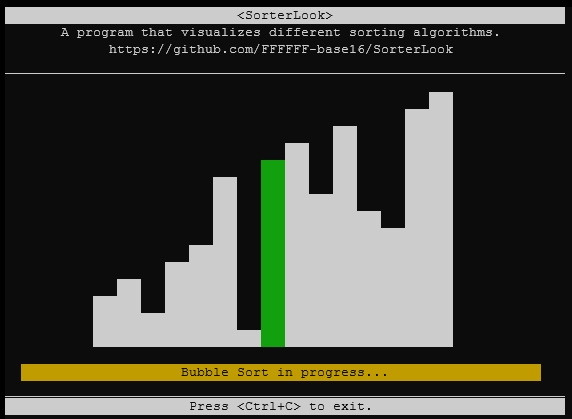

# SorterLook
A Python 3 package which renders visualizations of different sorting methods using `curses` and `concurrent.futures`. 

-----
## Example
A bubble sort visualization being performed.




-----
## Getting Started
Clone the repository:
```
git clone https://github.com/FFFFFF-base16/SorterLook
```
Run `run.py` with a `-t (type)` parameter of your choice: (See _Compatibility_ for Windows)
```
python run.py -t bubble
```
The command above will visualize a bubble sort, as seen in the example image above.

**A list of all supported file arguments:**

Type | Function | Syntax Example
---------|----------|-------
`bubble` | Perform a bubble sort. | `python run.py -t bubble`
`insertion` | Perform an insertion sort. | `python run.py -t insertion`
`merge` | Perform a merge sort. | `python run.py -t merge`


-----
## Compatibility
**SorterLook** makes use of the `curses` module for Python in order to display screen output. For **Linux systems**, the program should work without any additional modules being installed, as `curses` is included with Python 3. 

For **Windows systems**, the Windows `curses` module needs to be installed as `curses` is not officially supported by Windows:

```
pip install windows-curses
```

-----
## Supported (or soon to be) sorting algorithms:
- Bubble Sort
- Insertion Sort
- Merge Sort (incomplete but operational)
- *Quicksort (planned)*
- *Selection Sort (planned)*

-----
## References
- https://docs.python.org/3/library/curses.html
- https://docs.python.org/3.6/library/typing.html
- https://docs.python.org/3/library/concurrent.futures.html
- https://realpython.com/sorting-algorithms-python/